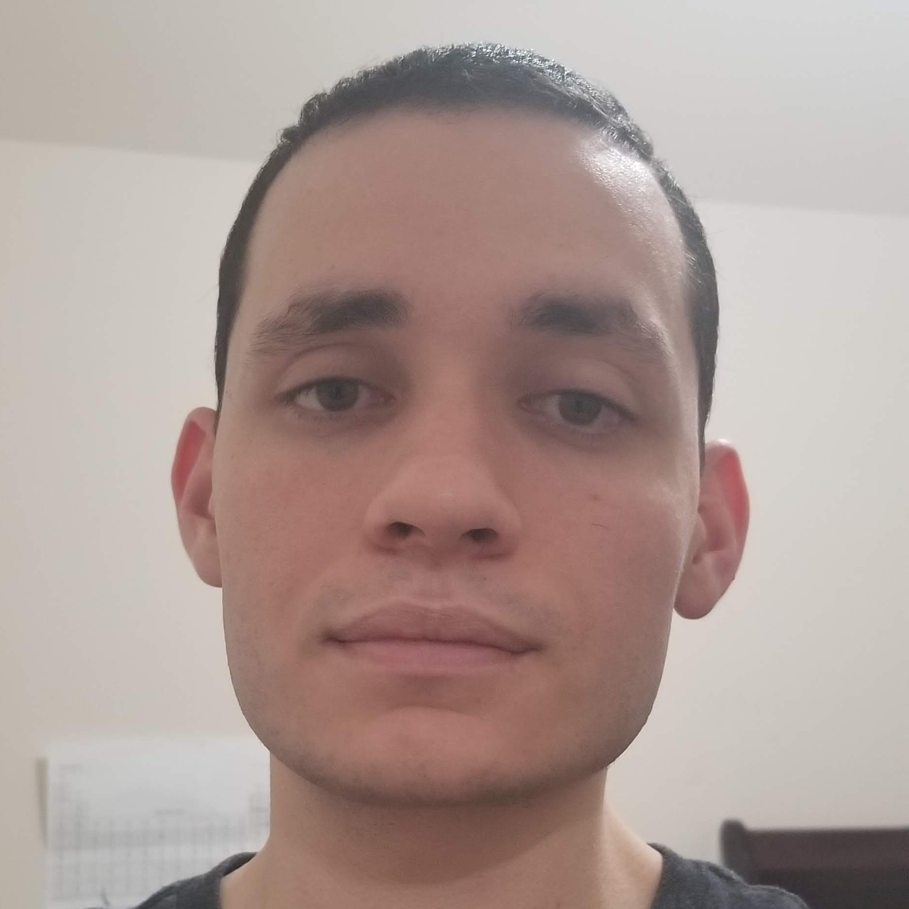

<link rel="stylesheet" href="./profile-picture.css">

I am a computer science graduate, and I am interested in software development.

I have worked as a research assistant by doing data processing and data analysis. I heavily used the numpy and pandas Python modules while doing this research. That being said, I also have former experience with Java, C#, and Swift, and all of my knowledge of C++ and Rust has been self-taught.

Although I am not a web developer, the cross-platform nature of web-technologies makes web-based applications too convenient to be overlooked. Therefore, I took the initiative to design a lean website so that people could reach me more easily, and so I could learn about web development.
