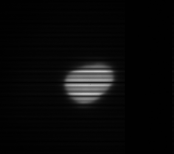
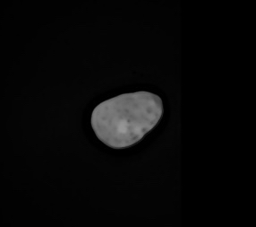
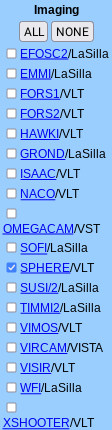
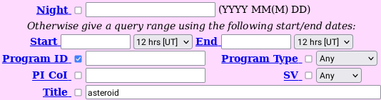
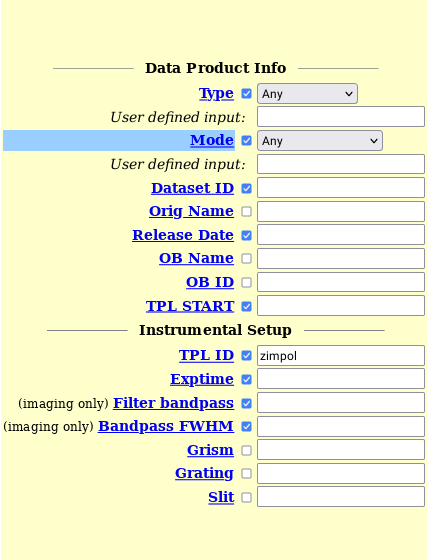
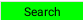
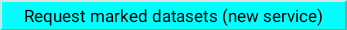
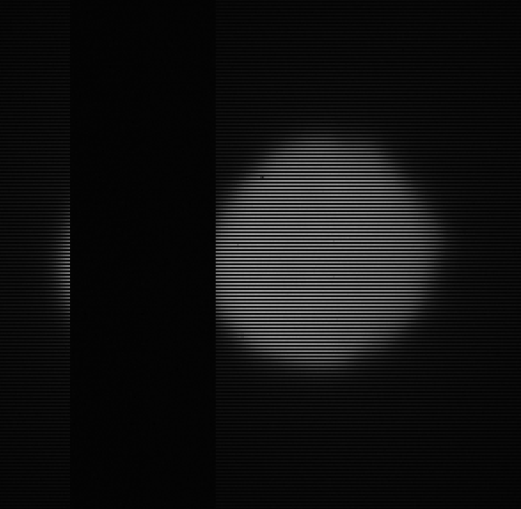
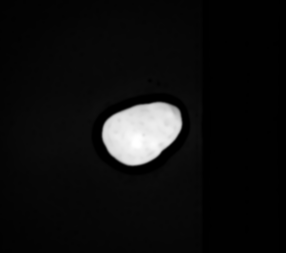

Raw asteroid images have visual artifacts that make them hard to analyze with
the naked eye, so image processing is necessary to highlight the features on the
asteroid surfaces.

<link rel="stylesheet" href="./css/class-centered-image.css">
<div style="display: flex; border-radius: 15px; align-items: center; font-size: 3em;">
  
  &rarr;
  
</div>

## Get asteroid images

Download asteroid images from
[archive.eso.org](https://archive.eso.org/eso/eso_archive_main.html).

1. Check **sphere** in the imaging section.
   

2. Type **asteroid** into the **Title** field.
   

3. Type **zimpol** into the **TPL ID** field.
   

4. **Optional**: specify the name of the asteroid in the **OB Name** field. Some
   asteroid name examples are Ceres, Pallas, Psyche, Vesta, etc.

5. Press **Search** and select the datasets you want to download.
   

6. Click on **Request marked datasets (new service)** at the bottom of the page.
   

7. Click on **Download ZIP file** to download the images.
   

## Uncompress the .zip and .Z files on Linux

1. Install the **unzip** utility to uncompress the .zip file.
2. Unzip the .zip file and save the contents in a folder called
   **unzipped_archive**.

```bash
$ unzip archive.zip -d unzipped_archive
```

3. Install the **uncompress** utility to convert .Z files into .fits files.
4. Decompress the .Z file and verify the values for DATE and TIME match your
   file.

```bash
$ uncompress "unzipped_archive/SPHER.(DATE)T(TIME).fits.Z"
```

## Uncompress the .zip and .Z files on Windows

1. Right-click the .zip file and select **Extract All** to chose a destination
   folder.
2. Use **[cloudconvert](https://cloudconvert.com)** to uncompress the .Z file of
   the form **SPHER.(DATE)T(TIME).fits.Z**

## View your .fits file and inspect your asteroid

Use **[GIMP](https://www.gimp.org/downloads/)** to open the .fits file and check
that there are no large, black stripes on the image. These vertical stripes ruin
the image and require us to obtain a different one. I recommend using the
[ephermis](https://ssd.jpl.nasa.gov/horizons.cgi?find_body=1&body_group=sb&sstr=1)
feature here before choosing what images to process.



## How to process images

Download **[ImageJ](https://imagej.nih.gov/ij/)** to do image processing. ImageJ
can open .fits files after they have been processed by GIMP. Use GIMP to export
.fits files into files that ImageJ can accept. Here is how an image on ImageJ
should look.


On the raw images there are 1-pixel-high stripes that span the entirety of the
images. To remove these horizontal black stripes, use ImageJ’s **remove
outliers** feature with a radius of 1 pixel, a threshold of 1, and set to dark.
After that, it is necessary to smooth the images a few times. Then open the
image on GIMP and sharpen it a lot to the point that it looks pretty noisy, then
open the image on ImageJ and remove both bright and dark outliers with a radius
of 3 to 8 pixels, then smooth the image again a few times. This is how the image
should look.



If you change an 8-bit image to a 16 or 32-bit image, it will automatically and
significantly increase the brightness of the image; however, changing a 32 or
16-bit image into an 8-bit image does not change the brightness. Make any color
corrections if they are needed. Here is the image after making color
corrections.


This asteroid is called _15 Eunomia_ and there appear to be two _faculae_
(bright spots) on its surface.


