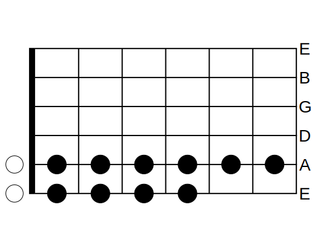

## General

There are 6 strings on a standard electric guitar. The strings represent notes
e, A, D, G, B, and E, where the lower-case e represents the thick, low-pitched
string. The mnemonic device I use to remember the order is "eat goobie", which
somehow maps to "eAD G(oo)B(i)E" in my brain.

There are at least 21 frets on a standard electric guitar. The frets are
numbered 0 through 21, where 0 means the string is played open, and 1 means the
string is played while pressing the fret closest to the tuning pegs and furthest
away from the guitar body.

## Note idiosyncrasies

In my notes, the letter S is a placeholder that represents all the \[s\]tring
guitars notes e, A, D, G, B, and E in a generic, formulaic, and algebraic way.

I describe note locations using X-Y coordinate notation, where X represents the
fret number and Y represents the note. For example, the coordinate (0,A) or 0A
represents playing the open A string.

In this co-ordinate system, the highest string e represents 0 and the lowest
string E represents 5. The reasoning behind this is that if a guitar were to
have 8 strings, string e would still be 0 and string E would still be 5, while
strings B and F# would be 6 and 7, respectively. This system is 0-indexed, not
1-indexed.

In other words, another way of writing 0A would be 04, where the 0 means the 0th
fret and the 4 represents the 4th string. This means 210 would be the 21st fret
on the highest string e.

## S5 chords

All the S5 chord root notes are located on the first 6 frets on strings e and A.
The root notes are 0A, 1A, 2A, 3A, 4A, 5A, 6A, 0E, 1E, 2E, 3E, and 4E. These
root notes represent A, A#, B, C, C#, D, D#, E, F, F#, G, and G#, respectively.

Interestingly, the notes A and \#A appear twice. Once at 0A and 1A, and again at
5E and 6E. Use 0A and 1A as the root notes. I have yet to come up with rationale
for this, but it probably has to do with the A, B, C, D, E, F, G note
progression, meaning that the A y-coordinate should be picked first.

Also interestingly, none of the root notes are located on the D, G, B, or E
strings.

The 5 in S5 means that the distance between a root note and the next octave is 5
units away. For example. The chord A5 requires notes 0A, 2D, and 2G to be
pressed, which is equivalent to (0,0), (2, 1), (2, 2) on Cartesian plane.

The chord shape is (Rx, Ry), (Rx+2, Ry-1), and (Rx+2, Rx-2), where Rx and Ry is
the root note fret and string position.

The range in which the S5 formula works is \[(0, 4), (6, 4)\] and \[(0, 5), (4,
5)\].

## Repeating octaves

Coming up with unique names for each note on the fretboard is difficult because
the same note appears multiple times. For example:

String e can play the note E on octaves 1, 3, and 4 on frets 0, 12, and 24,
correspondingly.

String A can play the note E on octaves 3 and 4 on frets 7 and 19,
correspondingly.

String D can play the note E on octaves 3 and 4 on frets 2 and 14,
correspondingly.

String E can play the note E on octaves 4, 5, and 6 on frets 0, 12, and 24,
correspondingly.

## Playing chords

Not all instruments can play chords. Wind instruments like trumpets, flutes,
oboes, slide whistles, and kazoos can only play one note at a time.

Some percussion instruments like the triangle also cannot play chords because
they cannot even play notes.

Play an arpeggio in order to play a chord using a single-note instrument, which
means playing each note in the chord in a descending or increasing order.

Interestingly, oboe reeds last about 8 hours of play before the sound quality
diminishes. Oboe players carve out their own reeds and set them apart depending
on their sound quality. Flutes do not need reads because they are more like
whistles, meaning they do not have vibrating parts.

In order to play chords, instruments must have multiple vibrating parts. For
example, each key in a piano can play a different note because each note is
produced by a string. Likewise, guitars can play 6 different notes because they
have 6 strings.

## Playing crescendos

Some instruments can perform crescendo more easily than others. Wind instruments
can increase the volume of a note by increasing the airflow. The violin can
achieve crescendo by either bowing the quickly, or bowing hard against the
violin strings to create quicker vibrations. Electric guitars use

Piano players cannot achieve crescendo on a single sustained note. They must
increase the force of each key press. Likewise, triangle players must increase
the strength of each strike. Guitars can somewhat achieve crescendo on a single
sustained note by using the guitar's volume knob, or by using strumming the
strings harder.

## Melody

A melody requires playing a sequence of different notes or sounds.

## Rhythm

A rhythm requires playing notes, sounds, and silences in a repeating pattern.

You can have rhythm without having melody by playing only one type of note.

## Harmony

Musical harmony requires playing 2 or more notes (a chord) or sounds that sound
good together.

## Expensive instruments

There are violins that are very expensive because they were made in the 16th
century. Stradivarius had various apprentices who also made other instruments.
Those instruments are also very expensive. Their instruments are worth millions
of dollars and usually the only way an artist can play them is if they are lent
to them by institutions or museums.

Violins, unlike brass instruments, get more expensive with age. They are an
investment. Brass instruments on the other hand such as trumpets or French horns
lose value with time and there are no brass instruments from the 16th century.

Also, Steinway pianos can cost upwards of 100,000. I have also heard that
expensive violins can cost upwards of \$400,000 and the bows can also get
ridiculously expensive. They can be like \$200,000. The reason for this is that
some bows are made with rare materials like ivory. Whenever violin players
travel, it is not uncommon for them to be stopped by customs and for customs to
try to take away their ivory items. However, bows and instruments containing
ivory are considered pieces of art and cannot be confiscated.

Pianos use good enough tuning as opposed to natural tuning which is the tuning
that Pythagoras found out. The reason for this compromise. I do not understand.
But to an experienced musician, this means that a piano always sounds just a
little bit out of tune.

## Pythagoras

Pythagoras realized that if you could the string in half and vibrated it, the
string will vibrate with twice the frequency. This is known as a higher octave.

He also did experiments and divided each octave, which you can think of as a
string, into 12 segments which became notes that make up an octave. The strange
thing about this is that notes B and E do not have a sharp version because
B-sharp would be the same as C and because E-sharp would be the same as F.
Likewise F-lat is the same as E.

## Transposition

Because trumpets didn't have valves up until the 19th century in the past, the
only way to change the tuning on a trumpet was to get a new trumpet or to insert
pieces into the trumpet to make it longer. Because of this, the music sheets
that were written in the 15th century, when trumpets didn't have vows, are
written with the same notes in different scales which is known as transposition.
Nowadays trumpets have valves, but the music sheets didn't change. So the music
sheet will say something like play in C or play in B and the player has to do
the mental math to do the transposition in their heads. Some instruments like
guitars or flutes or trombones never transpose.

## Solfagé

The point of solfagé is to be able to read music sheets extremely fast because
you're able to audiate or sound out the keys as you are reading them. This works
best for instruments like trumpets or windpipe instruments where you can only
arpeggiate or in other words play one note at a time, which works well whenever
you are pronouncing the sounds with your voice. This may not work very well for
instruments like piano. Although I wonder if there may be some unique technique
to make it possible.

Professional players are able to go into an arrangement and read music sheets
for the first time and be able to play along with other people, even if they
have never played the song for in their lives.

Usually, the spacing in music sheets does not matter, unless there are multiple
voices in the arrangement, and the voices must be synchronized.

And here by voice I mean the sound of other instruments such as trumpets or
trombone's or French horns.

Whenever taking solfagé classes, it's usually guitar players and singers that
have the worst rhythm. People who play instruments like a trumpet can follow the
rhythm as they press the valves. It is very noticeable whenever a singer has
good rhythm. It is not the fault of the singer that he or she does not have good
rhythm because he or she is usually yelling as loud as possible, so he or she
cannot hear anything else but their own voice, so they cannot synchronize
themselves to the rhythm of the other voices in their arrangement.

## Frequencies

What is A440? It basically defines a frequency of 440 vibrations per second to
equal the note A at the 4th octave, meaning that if you played a note with a
frequency of 880, that would be an A5, an octave higher.

A4: 440Hz

A3: 220Hz

A2: 110Hz

A1: 55Hz

A0: 27.5Hz (fundamental frequency)

A-1: 13.75 Hz (cannot be heard but can be felt)
