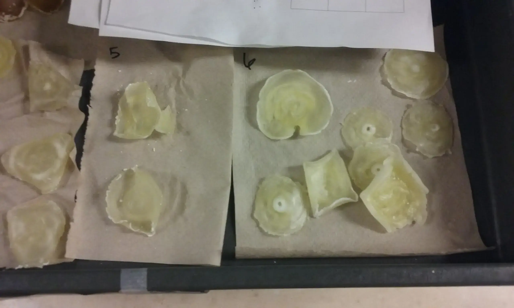
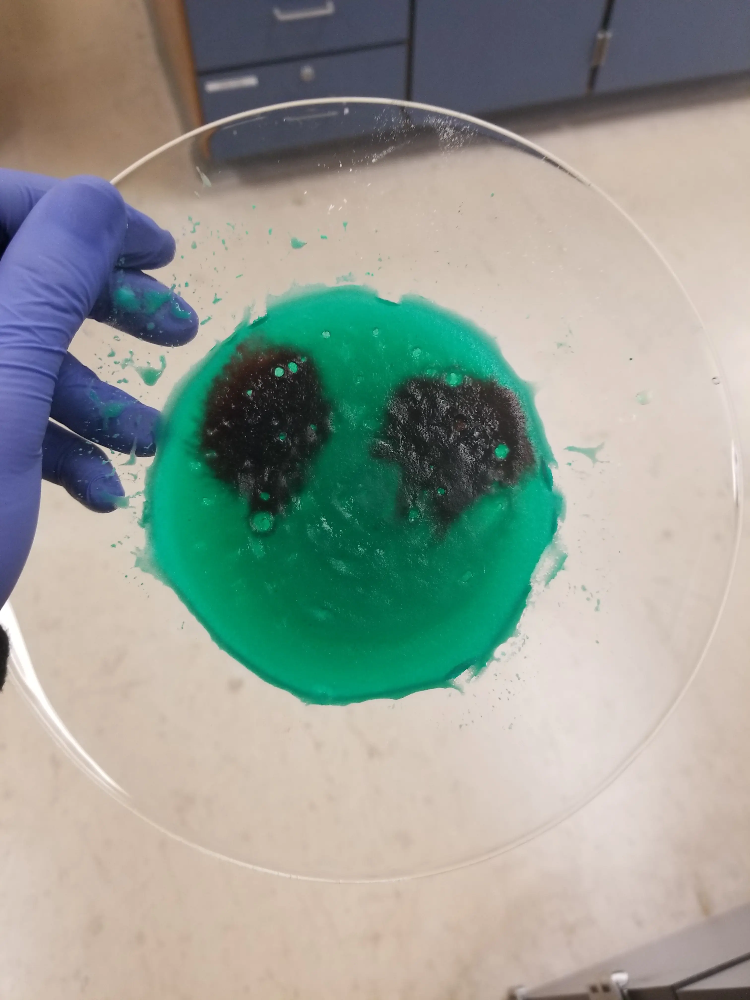
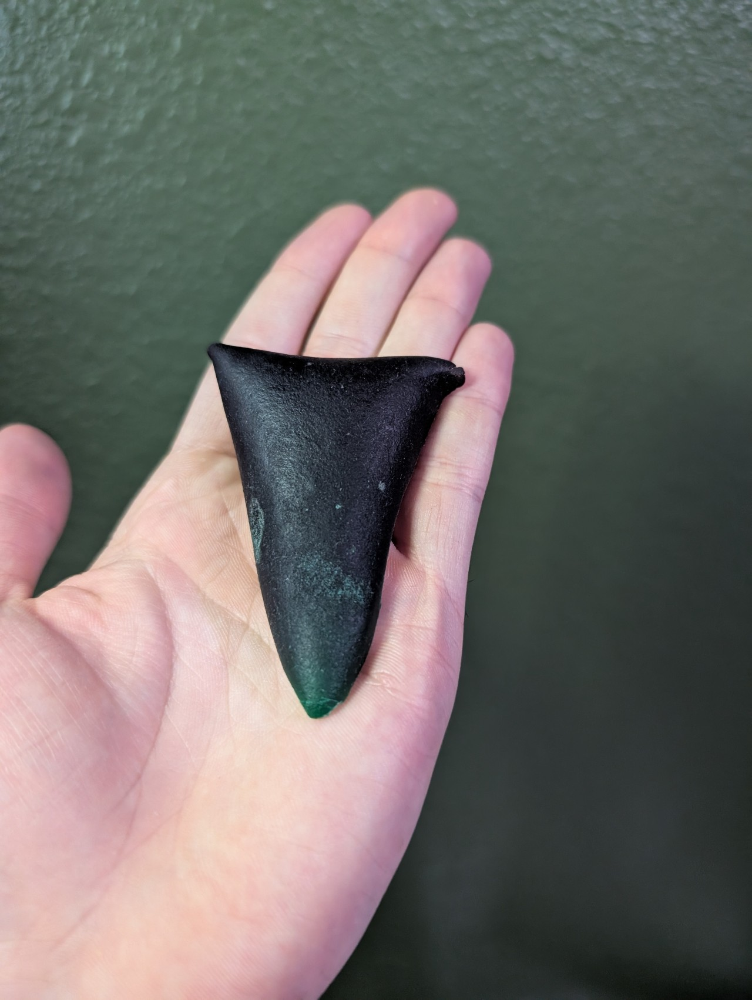

I worked in a chemistry lab in 2019, and one of the lab experiments we did
involved making bio-plastics. Plastics are polymers, which means they are made
out of long chains of molecules. The polymers can be man-made, like nylon (which
we also made in the lab), or natural, like DNA.

You could spit into a tube to collect cheek cells and then break the cells to
isolate the DNA (which we also did for biology class), and then use the DNA to
make plastic, but people will raise their eyebrows if you show them a white slab
of bio-plastic and you tell them its is made from your DNA.

A better idea is to use biodegradable polymers from plant sugars to make
composite plastics. These are some ingredients you can use:

- Agar, a polymer made from algae.
- Cornstarch, a polymer made from corn.
- Glycerin, a plasticizer made from plant oil or animal fat to make the plastic
  more flexible.
- Potato starch, a polymer made from potatoes.
- Rice starch, a polymer made from rice.
- Water, a plasticizer that makes the polymers flexible for mixing, and harder
  once dried.

With those ingredients, you can try mixing different parts of cornstarch, agar,
rice starch, potato starch, water, and glycerin. For example, you could start
with 10mL of cornstarch, agar, and glycerin, and 50mL of water. Technically,
only water and one type of starch is needed.

Then you can mix the ingredients thoroughly and microwave them. I suggest
microwaving the mixture for less than 30 seconds at a time and letting the
mixture cool down before reheating it, otherwise the mixture will heat up
unevenly and the result will look like what it is -- dried up potato soup.

The image below shows that the samples in batch 6 heated up unevenly, so the
samples had craters because the centers boiled. In the other side, the samples
in batch 5 heated up evenly and resembled actual plastic.

It is kind of autistic, but I had fun making an alien face with food colorant.

I could have also used red food colorant to make an angry red orb monster.

I wanted to test how long the bioplastic would last, so I kept it in a cool,
dark place unreachable by sunlight (my room, lol) inside a box along with other
college mementos.

It has been more than 5 years, and the alien face did not decompose, but it did
shrivel up and become unrecognizable.

Honestly, it looked the same 3 years ago as it does now. It does not have a
weird smell. The texture feels smooth and slightly oily, but not grossly so. I
only feel like washing my hands if I think too much about how long it has been
sitting around.

I feel conflicted because bio-plastics are supposed to be bio-degradable, but
this sample has lasted too long. No roaches, ants, bugs, bacteria, etc., ate it
or decomposed it. Hopefully it would decompose naturally in a landfill if it got
exposed to rain water, but I am not sure it would be a fast process.

In general, bio-plastics are probably not mass produced because they are more
expensive than plastics made from natural gas byproducts or petroleum, but the
ingredients are simple, so it is fun working with them.
