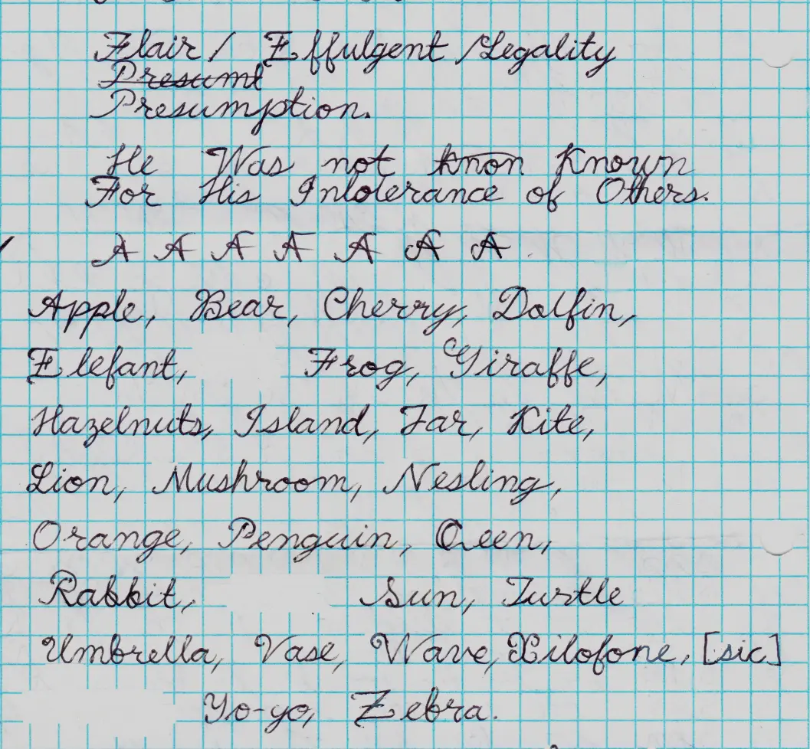

Writing cursive sucks because it looks ugly, so I spent some time creating my
own style: 

Russian cursive is alright as it is. Here it is for reference:

You can download and install
[Konsolapa script Russian cursive font](./Kosolapa_Script_Russian_Cursive_Font.zip).

Download and decompress the file into `~/.local/share/fonts`.

If you are using NixOS, you may need to enable the following setting:

`fonts.fontDir.enable = true;`

You can list installed font by running the command
`find -L /run/current-system/sw/share/X11/fonts -type f -exec fc-query -f "%{family[0]}\n" {} \; | sort | uniq`,
but the fonts in `~/.local/share/fonts` may not show up.
